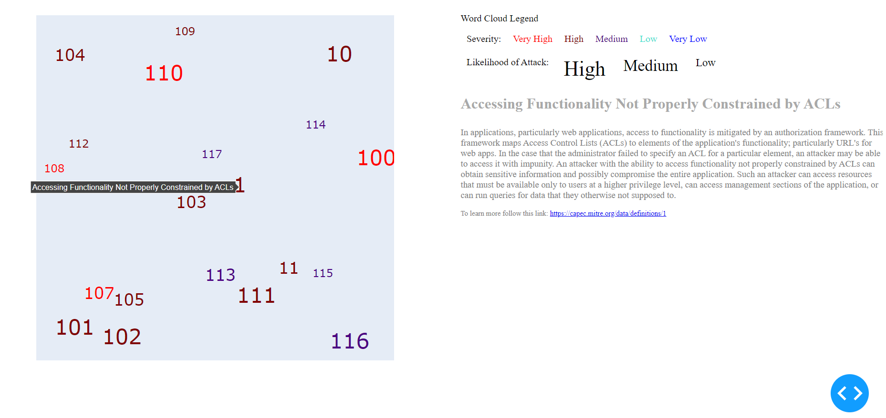

Common Attack Pattern Enumeration and Classification (CAPEC) is a public catalog of common attack patterns that helps users understand how adversaries exploit weaknesses in applications. This dash application displays a word cloud visualization of the CAPEC catolog, and aims to provide a structured way to describe attack patterns and help security professionals better understand how attackers operate, which in turn helps them better defend against attacks. Each attack pattern in the CAPEC catalog has a unique identifier and is described in detail, including information on the attack's goals, typical defenses, and related attack patterns, etc. This application includes radio items, hover and click components as a way to promote interactive learning. 
   

